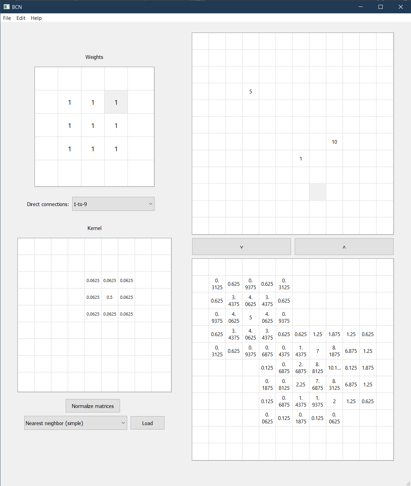

# BCN

**Madison Landry**

This repository contains the source code for my master's thesis project, in which I investigate an abstraction of neural networks called branched connections networks (BCNs) that appear in [neuromorphic hardware](https://en.wikipedia.org/wiki/Neuromorphic_engineering), particularly optics-based neuromorphic hardware, to uncover strategies to better train these networks and devices.

[Code documentation is currently hosted here](https://web.mit.edu/almonds/www/BCN/index.html). (I can't guarantee it will stay there for long.)

## Running locally

Follow [these instructions](https://pytorch.org/get-started/locally/) to install PyTorch.

In a Python (3.8 or higher) environment, run

```bash
pip install -e .
```

(todo: upload wheels to pypi?)

## Using the GUI

This repo contains a GUI that can help familiarize one with BCNs.

The application is a sandbox where one can experiment with different direct connections and branching connections, and visually see the input & output planes.

To run the GUI:

```bash
python gui.py
````

Interface gist:

- **Weights panel** (top left): Modify the *direct connection* weights for every neuron. Note that for this sandbox, the weights defined in the Weights panel correspond to *every* neuron in the input plane. This is for simplicity; an abstract BCN will almost always have a different set of weights for every neuron.
- **Kernel panel** (bottom left): Modify a direct connection's *set of branches*. To begin editing here, first select a direction in the Weights panel corresponding to a direct connection. There are several branching families to choose from and load.
- **Input plane** (top right): By pressing the `v` button, these inputs are transformed into the output plane according to one's choice in direct connection weights and branching connections.
- **Output plane** (bottom right): The output plane can be copy-pasted to the input plane by pressing the `^` button. Alternating `v` and `^` button presses, in some sense, corresponds to a signal propagating through a multi-layer BCN.


